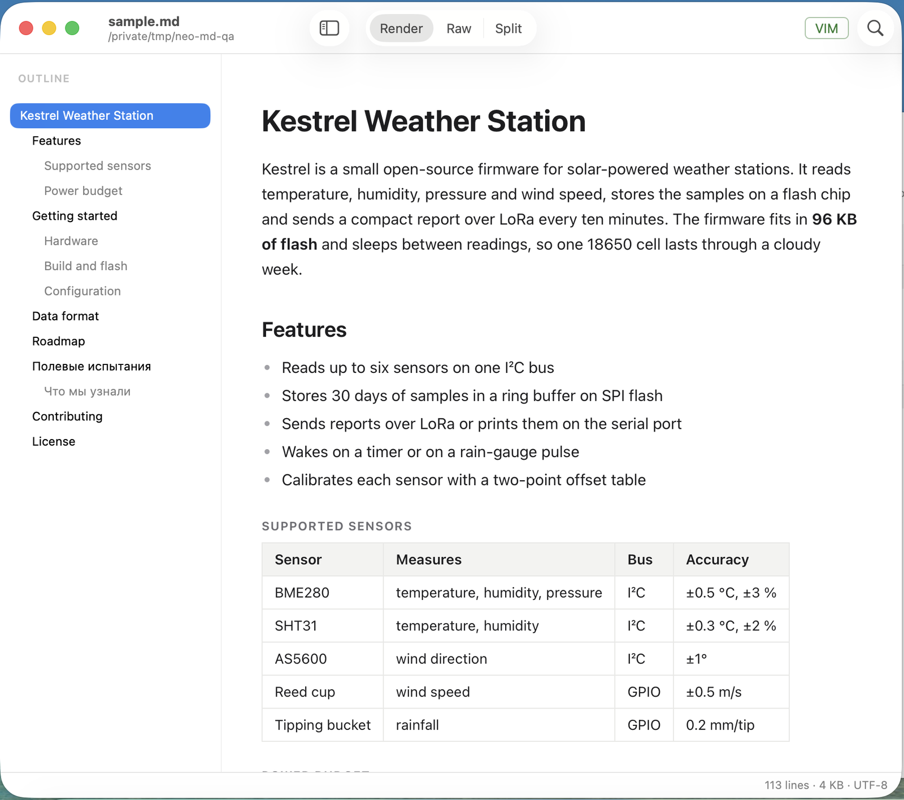
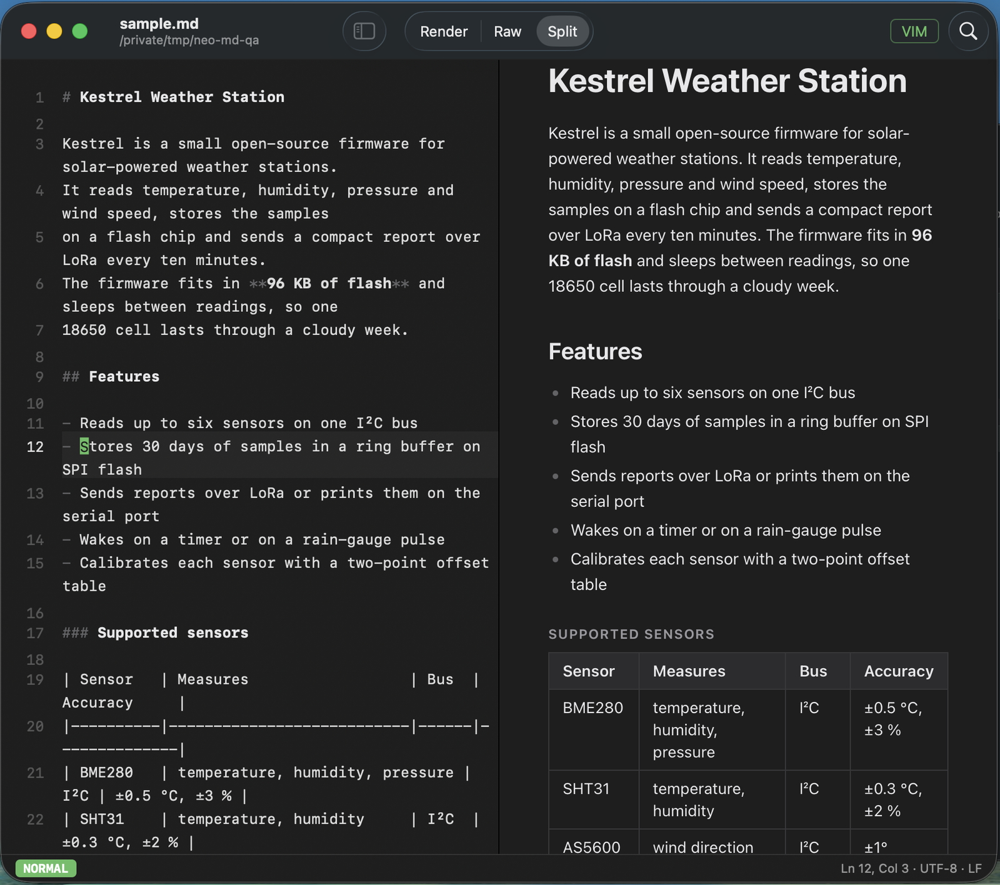
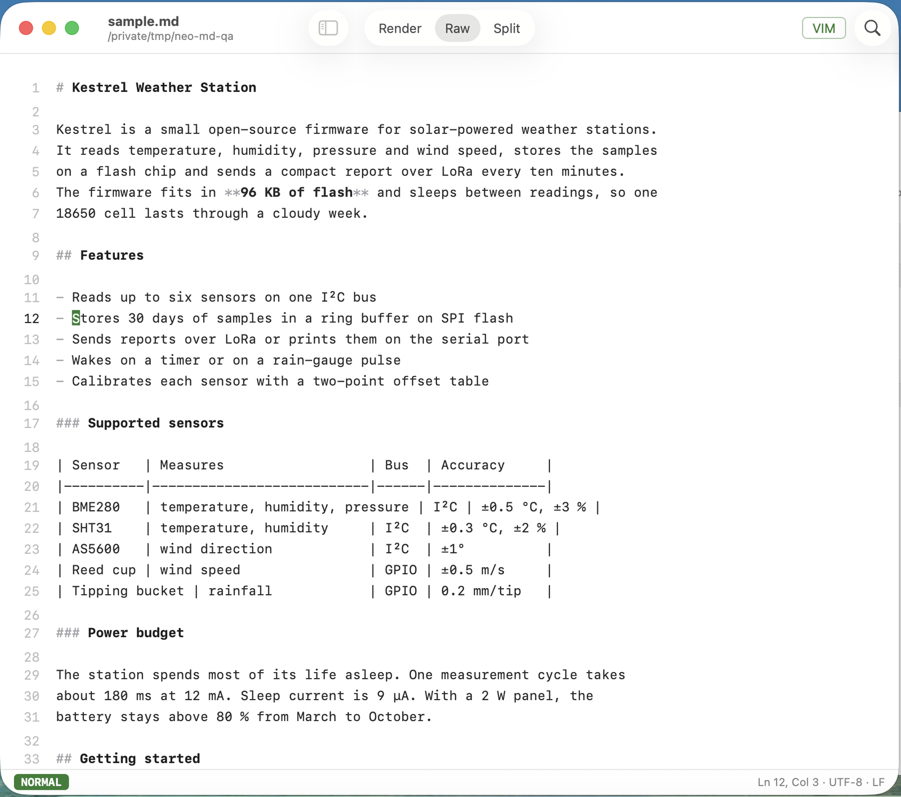

# neo-md

neo-md is a native macOS app to read and edit Markdown files. It renders CommonMark and GitHub Flavored Markdown in a Render view, shows the source text in a Raw editor, and shows both side by side in a Split view. The app follows the macOS light or dark appearance or uses a fixed theme, shows an outline of the headings, and offers standard macOS key bindings or a subset of Vim key bindings in the editor. You can change the reading font, the editor font and the text size, and export a document as PDF or HTML. A Quick Look extension shows the rendered file when you press Space on a `.md` file in Finder.







## Features

- Three views for each document: Render, Raw and Split.
- The theme follows the macOS light or dark appearance, or is always light or always dark.
- A reading font for the Render view and an editor font for the editor in the Raw and Split views.
- One text size for the Render view and the editor in all windows. Change it with ⌘+ and ⌘-. neo-md keeps the size after a restart.
- An outline sidebar in the Render view lists the headings. Click a heading to go to it. You can hide the outline.
- Standard macOS key bindings or a subset of Vim key bindings in the editor.
- Live preview: the Split view renders while you type and scrolls the preview with the editor.
- Find in the document.
- Export as PDF or as HTML.
- Reload on disk change. If the file changes on disk and you have no unsaved edits, neo-md loads the new text. If you have unsaved edits, a banner lets you keep your text or reload the file.
- A welcome window with a drop zone and up to 8 recent files when no document is open.
- neo-md can be the default app for `.md` files.
- Quick Look preview in Finder: select a `.md` file and press Space.

## Install from the DMG

1. Open `neo-md-0.2.0.dmg`.
2. Drag `neo-md.app` to the `Applications` folder.

The app is ad-hoc signed and is not notarized. Thus macOS blocks the first launch. To open it the first time, do one of these steps:

- In Finder, right-click `neo-md.app` in `Applications`, select **Open**, then confirm.
- Or remove the quarantine flag in Terminal:

  ```sh
  xattr -dr com.apple.quarantine /Applications/neo-md.app
  ```

## Make neo-md the default Markdown app

Do one of these steps:

- Open Settings (⌘,), select **General**, and click **Make default** in the **Default app** row. When neo-md is the default, the row shows "neo-md is the default".
- Or run this command in Terminal:

  ```sh
  /Applications/neo-md.app/Contents/MacOS/neo-md --make-default
  ```

  The command prints `default: ok` on success and exits without a window.

## Quick Look

Start neo-md once after you install it. This lets macOS register the Quick Look extension. Then select a `.md` file in Finder and press Space to see the rendered file.

Images do not show in Quick Look. The Quick Look preview is read-only.

## Settings

Open Settings with ⌘,. The Settings window has two panes: **General** and **Appearance**. Click a pane in the toolbar to show it. Each change applies immediately.

### General

| Row | Values |
|---|---|
| Key bindings | Normal or Vim |
| Open files in | Render or Raw |
| Default app | **Make default** button, or "neo-md is the default" |

### Appearance

| Row | Values |
|---|---|
| Theme | Follow macOS, Light or Dark |
| Reading font | The font of the Render view. Click **Change…** to select a font family. Click **Reset** to use the system font again. |
| Editor font | The font of the editor in the Raw and Split views. Only fixed-pitch (monospaced) font families are accepted. Click **Reset** to use SF Mono again. |
| Text size | 75 % to 180 %. Click − or + to change the size by one step. |

The font panel sets only the font family. The text size setting sets the size. If a selected font is no longer installed, neo-md uses the default font.

## Keyboard reference

| Shortcut | Action |
|---|---|
| ⌘1 | Render view |
| ⌘2 | Raw view |
| ⌘3 | Split view |
| ⇧⌘O | Hide or show the outline |
| ⌘F | Find |
| ⌘G / ⇧⌘G | Next match / previous match (Render view find bar) |
| ⌘R | Render now |
| ⌘+ or ⌘= | Bigger text |
| ⌘- | Smaller text |
| ⌘0 | Actual size (100 %) |
| ⇧⌘E | Export as PDF |
| ⌘, | Settings |
| ⌘O | Open a file |
| ⌘S | Save |
| ⌘W | Close the window |
| ⌘Z / ⇧⌘Z | Undo / redo |

Shortcuts with ⌘ work in every Vim mode. The text size shortcuts work in all windows, also when no document is open.

## Export

Select **File > Export as PDF…** (⇧⌘E) or **File > Export as HTML…**. The save dialog opens in the folder of the Markdown file. Both exports use the reading font and the text size from Settings.

- PDF: the document is split into pages with 20 mm margins. The paper size is the default paper size of macOS. The page is always light, also when the app uses the dark theme. Images with relative paths are included in the PDF.
- HTML: one standalone file that contains all styles. The page follows the light or dark appearance of the browser. Relative links and image paths stay relative. Save the HTML file in the folder of the Markdown file, so that relative images load.

## Vim key bindings

Select **Vim** in the **Key bindings** row of Settings > General to use these keys in the editor (Raw and Split views). The status bar shows the current mode.

| Keys | Action |
|---|---|
| `h` `j` `k` `l`, arrow keys | Move left, down, up, right |
| `w` `b` `e` | Next word start, previous word start, word end |
| `0` `^` `$` | Line start, first non-blank character, line end |
| `gg` `G` | First line, last line (with a count: go to that line) |
| Count before a command | Repeat it, for example `3j`, `2dw`, `2d3w` |
| `i` `a` `I` `A` `o` `O` | Enter insert mode |
| Esc, Ctrl-[ | Back to normal mode |
| `x` | Delete the character under the cursor |
| `d`, `c`, `y` + motion | Delete, change or yank (copy) over the motion |
| `dd` `cc` `yy` | Delete, change or yank whole lines |
| `D` `C` | Delete or change to the line end |
| `p` `P` | Paste after or before the cursor (whole lines go below or above) |
| `u`, Ctrl-R | Undo, redo |
| `v` `V` | Visual mode, visual line mode |
| `d` `x` `c` `y` in visual mode | Delete, change or yank the selection |
| `/pattern` Enter | Search forward (literal text, wraps at the end) |
| `n` `N` | Next match, previous match |
| `:w` | Save |
| `:q` | Close |
| `:wq`, `:x` | Save and close |
| `:q!` | Close without saving |
| `:<number>` | Go to that line |

Yanked text also goes to the macOS clipboard.

These Vim features are not supported: `.` repeat, macros, named registers, text objects (for example `iw`), and `:s` substitution.

## Build from source

Requirements:

- macOS 14 or later.
- A Swift 6 toolchain, from Xcode or from the Command Line Tools.

Build the app bundle:

```sh
scripts/bundle.sh
```

The result is `build/neo-md.app`. Set `NO_QL=1` to build without the Quick Look extension.

Build the DMG after the app bundle:

```sh
scripts/dmg.sh
```

The result is `build/neo-md-0.2.0.dmg`.

Run the tests:

```sh
swift test
```

With the Command Line Tools only (no Xcode), `Testing.framework` is outside the default search paths. Add the Command Line Tools framework directory (`/Library/Developer/CommandLineTools/Library/Developer/Frameworks`) to the compiler framework search path, the linker framework search path and the runtime search path (rpath). Also pass `-Xfrontend -disable-cross-import-overlays` to the compiler. `scripts/remote.sh` contains the full `swift test` command with these flags.

## License

All rights reserved.
